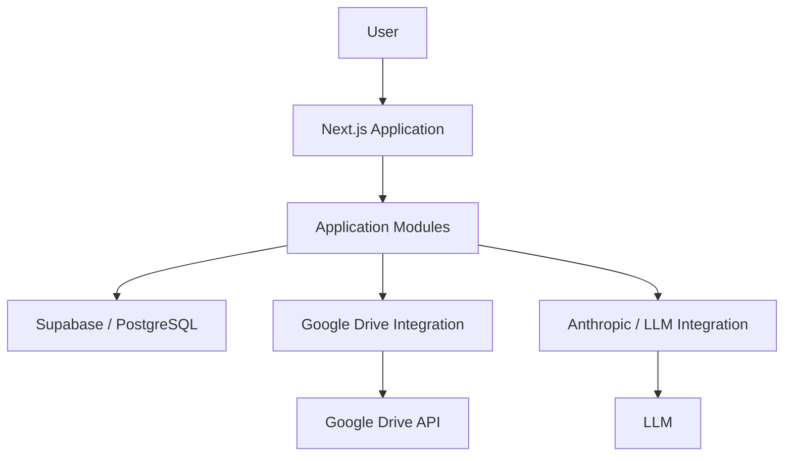
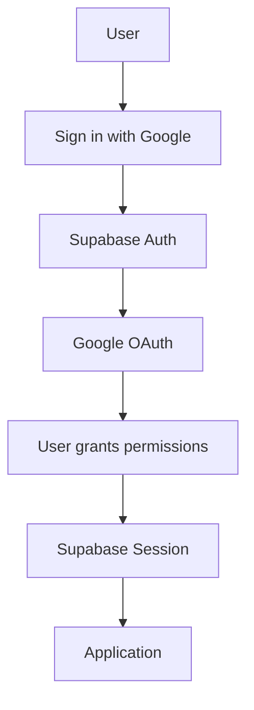
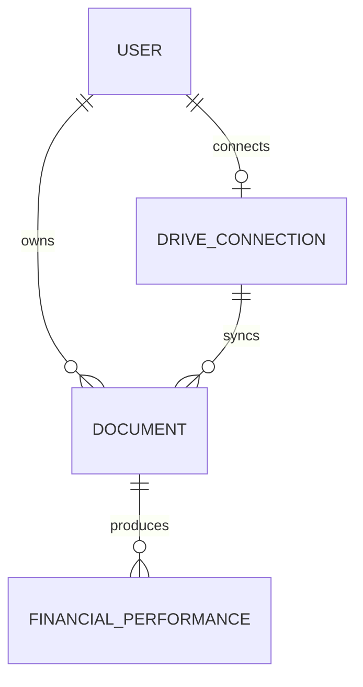
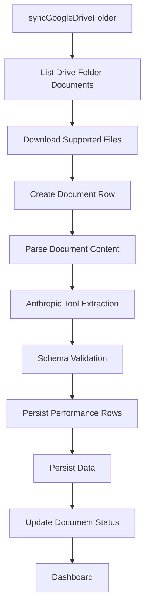
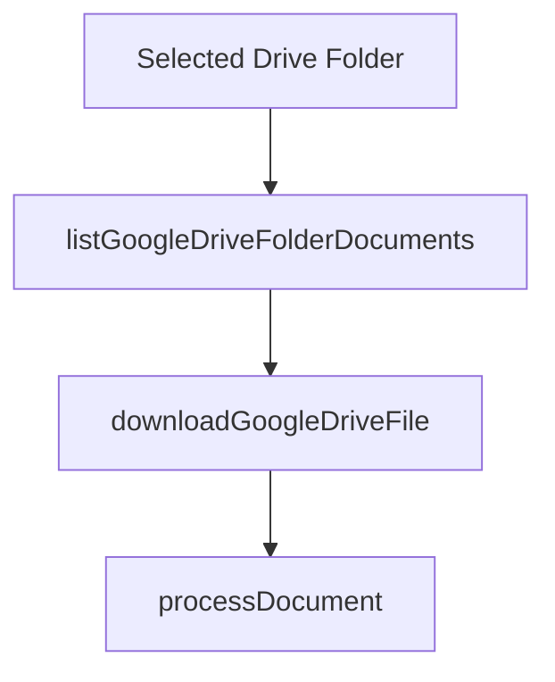
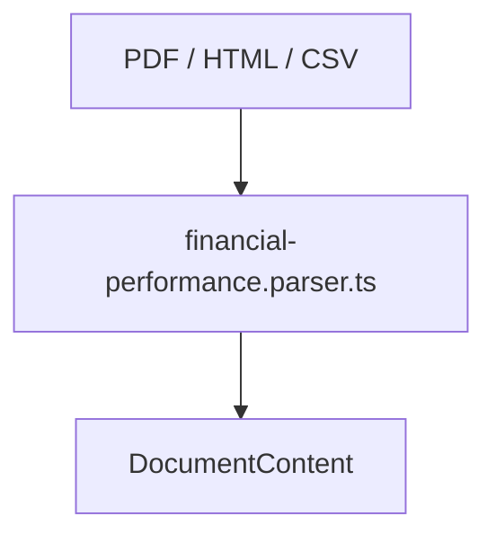
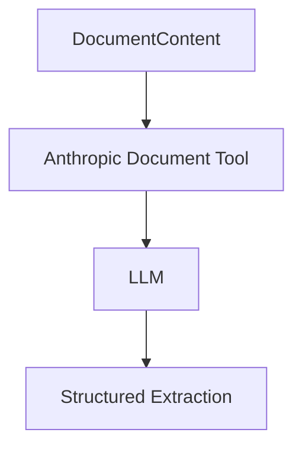
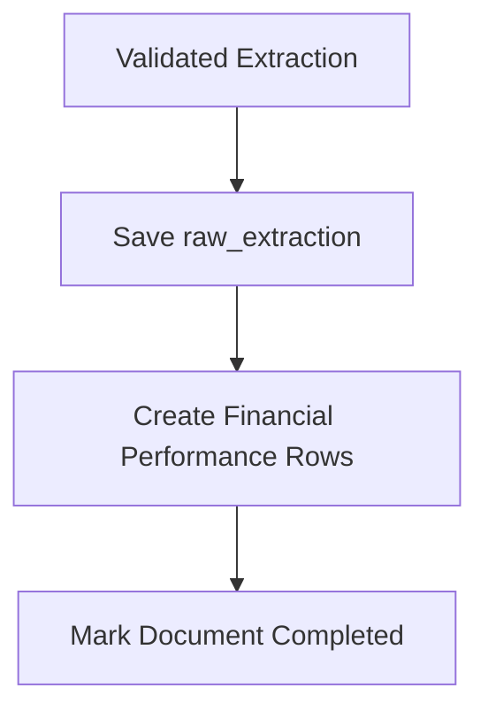
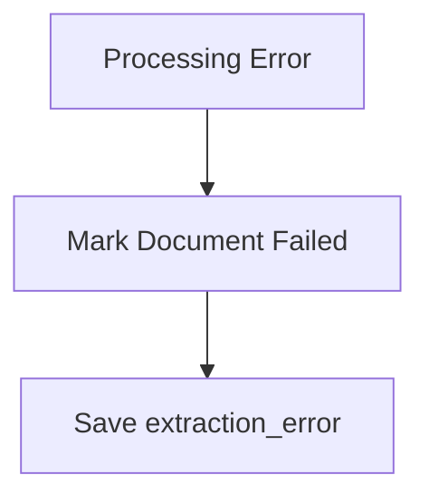
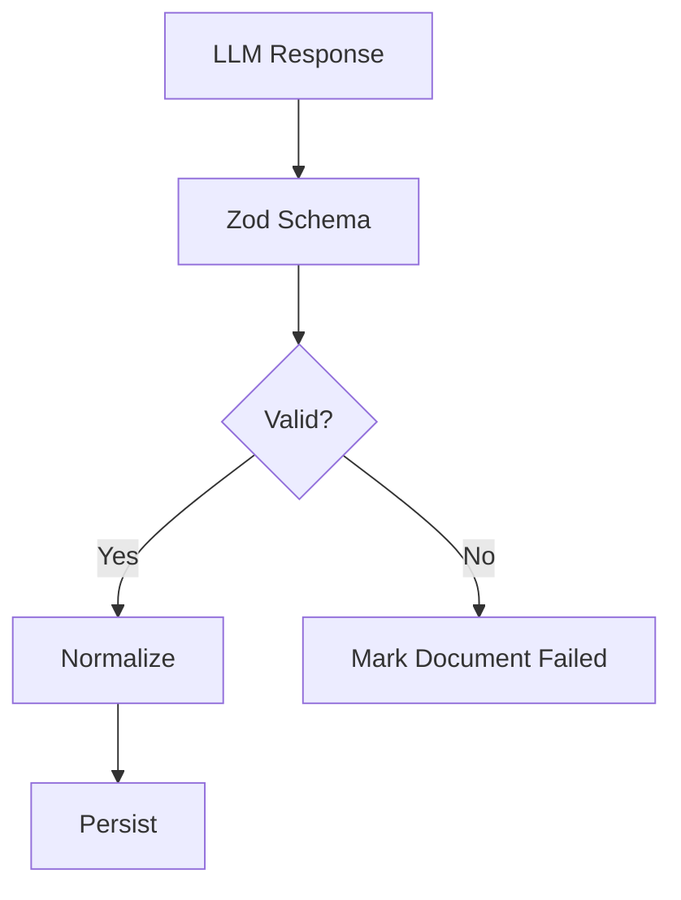

# Technical Architecture — Equi Document Intelligence


`smart-findoc-analyzer` owns the initial Google Drive sync flow, document parsing, LLM extraction, validation, and persistence orchestration. Provider implementations live under `src/provider/` and are mocked in tests. File cleaning utilities are reusable and are not tied to a feature.

## 1. Goal

Build a simple, modular document intelligence application that:

* Connects to Google Drive through OAuth.
* Monitors one selected folder.
* Ingests PDF, HTML, and CSV files.
* Uses an LLM to understand document structure and extract normalized financial data.
* Stores document metadata and extracted records in Supabase/PostgreSQL.
* Exposes the data through a Next.js dashboard with search, filters, and sorting.

The system should remain focused on the assessment requirements and avoid unnecessary infrastructure.

---

## 2. Architecture

### 2.1 System Architecture



### 2.2 Components

#### Next.js

Main application layer.

Responsible for:

* UI
* Routes
* Authentication flow
* Server actions / API routes
* Calling application modules

Pages and components should not contain business logic that belongs inside modules.

---

#### Supabase

Used for:

* PostgreSQL database
* Authentication if needed
* Server-side database access

Google Drive remains the source of truth for original documents.

---

#### Google Drive

External document source.

Responsible for:

* OAuth authorization
* Folder selection
* Listing files
* Reading file metadata
* Downloading file content
* Detecting new or updated files

Google-specific implementation is injected through provider adapters when this integration is implemented.

---

#### Anthropic / LLM

Responsible for document understanding.

The LLM receives document content and must:

* Identify the document structure
* Understand terminology
* Understand tables and labels
* Identify financial entities and values
* Return structured output matching the extraction schema

The current extraction path uses Anthropic's document/tool flow in `financial-performance.parser.ts`. `src/provider/llm.provider.ts` remains available for simpler JSON extraction and tests.

---
### 2.3 Project Structure

This repository is a monorepo. The existing `src/` tree is the source of truth; no separate backend application is introduced.

```text
src/
├── app/                         # Next.js routes and pages
├── components/                  # Shared UI components
├── features/
│   └── smart-findoc-analyzer/   # Document extraction feature
│       ├── index.ts             # Public API
│       ├── schemas/             # Zod schemas and domain types
│       │   ├── document.schema.ts
│       │   └── performance.schema.ts
│       ├── services/            # Flow orchestration
│       │   └── analyzer.service.ts
│       ├── actions/             # Google Drive and LLM extraction actions
│       │   ├── google-drive.action.ts
│       │   └── financial-performance.parser.ts
│       └── __tests__/           # Feature-level flow tests
├── provider/                    # Provider-agnostic external adapters
│   ├── google.provider.ts        # Google OAuth and Drive client
│   └── llm.provider.ts           # LLM provider helpers and mocks
├── utils/                       # Reusable file/content utilities
│   └── document-text.ts
└── lib/
    └── supabase/                # Database clients and test doubles
```
## 3. Authentication & Google OAuth

Authentication is handled with **Supabase Auth**.

Google is used as the authentication provider and as the authorization mechanism for accessing the user's Google Drive.

### Authentication Flow



### Supabase

Use the Supabase CLI for local development and database/auth configuration.

Typical workflow:

```bash
supabase start
supabase status
supabase db reset
```

Supabase is responsible for:

* User authentication
* Session management
* User identity
* PostgreSQL persistence

Authentication-specific application code should use the existing Supabase clients under:

```text
src/lib/supabase/
├── backend-client.ts
└── mock-repository.ts
```

### Google OAuth

Google OAuth must be configured in Google Cloud Console.

Required setup:

* Enable Google Drive API
* Configure OAuth consent screen
* Create OAuth Web Client
* Configure local and production redirect URLs
* Add the application as a test user while the OAuth app is in testing mode

Initial Google scopes:

```text
openid
email
profile
https://www.googleapis.com/auth/drive.readonly
```

`drive.readonly` is required so the application can read existing files from the folder selected by the user.

### Google Credentials

Required environment variables:

```text
GOOGLE_CLIENT_ID=
GOOGLE_CLIENT_SECRET=
GOOGLE_REDIRECT_URI=
```

Supabase Google provider configuration must use the same Google OAuth credentials.

### Drive Authorization

After authentication, the application must have enough Google authorization to access Drive.

The application should be able to:

```text
authenticate user
      ↓
obtain Google OAuth authorization
      ↓
access Google Drive API
      ↓
select folder
      ↓
read folder contents
```

Google Drive access remains isolated behind `src/provider/google.provider.ts` and `actions/google-drive.action.ts`; the analyzer service consumes those actions and does not call the Google SDK directly.

Do not place Google OAuth or Drive-specific logic directly inside UI components.


## 4. Data Model

### 4.1 Entity Relationships



### 4.2 Entities

### User

Represents the application user.

Key data:

* `id`
* `email`
* profile information
* `created_at`
* `updated_at`

Relationships:

* Has one active Drive connection in the initial version
* Owns documents

---

### DriveConnection

Represents the user's Google Drive integration.

Key data:

* `id`
* `user_id`
* Google account identifier
* selected `folder_id`
* selected `folder_name`
* OAuth token information
* `created_at`
* `updated_at`

Relationships:

* Belongs to a user
* Provides documents from the selected folder

---

### Document

Represents one file discovered in the selected Google Drive folder.

Key data:

* `id`
* `user_id`
* `drive_connection_id`
* `drive_file_id`
* `name`
* `mime_type`
* `modified_time`
* `status`
* `raw_extraction`
* `extraction_error`
* `processed_at`
* `created_at`
* `updated_at`

Processing status:

```text
pending
processing
completed
failed
```

Relationships:

* Belongs to a user
* Comes from a Drive connection
* Produces performance records

`drive_file_id` uniquely identifies the source file from Google Drive.

---

### FinancialPerformance

Represents normalized financial information extracted from a document.

Key data:

* `id`
* `document_id`
* `user_id`
* `drive_file_id`
* `fund`
* `manager`
* `document_type`
* `reporting_date`
* `strategy`
* `aum`
* `nav`
* `ending_balance`
* `ytd_return`
* `since_inception`
* `created_at`

Relationships:

* Belongs to a document

Every normalized record must keep a reference to its source document.

---

## 5. Document Processing

### 5.1 Processing Flow



---

### 5.2 Drive Sync

The Drive integration currently lists supported files in the selected folder and downloads them for processing through `syncGoogleDriveFolder`.



Current rules:

* PDF, HTML, and CSV files are accepted.
* Unsupported mime types are ignored.
* Each supported file is passed into `processDocument`.
* Idempotency and `modified_time` reprocessing are still pending.

---

### 5.3 Document Parser

`smart-findoc-analyzer/actions/financial-performance.parser.ts` prepares the source document for the LLM.

It does not interpret financial meaning.



Common internal representation:

```ts
type DocumentContent = {
  filename: string
  mimeType: string
  content: string | Buffer
}
```

The parser handles file preparation only.

Do not create manager-specific or document-specific parsers such as:

```text
BlackRockParser
VanguardParser
FundFactsheetParser
AccountStatementParser
```

The LLM is responsible for understanding those differences.

---

### 5.4 LLM Extraction

The document content is sent to Anthropic together with a tool schema that returns normalized performance rows.



The LLM may identify:

* Document type
* Fund name
* Fund manager
* Report date
* Strategy
* AUM
* YTD return
* NAV
* Ending balance
* Since inception return

Example:

```ts
{
  performance: [
    {
      fund: "Alpha Growth Fund",
      manager: "Alpha Capital",
      documentType: "fund_factsheet",
      reportingDate: "2026-01-31",
      strategy: "Global Equity",
      aum: 850000000,
      nav: 125.30,
      endingBalance: null,
      ytdReturn: 0.076,
      sinceInception: 0.097
    }
  ]
}
```

The LLM handles differences in:

* Layout
* Terminology
* Tables
* Document structure
* Source format

---

### 5.5 Persistence

After validation, the extraction is normalized and persisted.



If processing fails:



---

## 6. Validation

All LLM output must be validated before being written into normalized database tables.

Use Zod.



Validation should cover:

* Required fields
* Dates
* Numeric values
* Percentages
* Currency
* Optional fields
* Extraction structure

Schemas live inside the related module.

Current schema files:

```text
documents.schema.ts
performance.schema.ts
```

---

## 8. Testing

Use **Vitest** for unit testing.

The initial testing scope focuses on the main Drive-to-analysis flow inside:

```text
src/features/smart-findoc-analyzer/
```

### What to Test

Unit tests should cover:

* `syncGoogleDriveFolder`
* Google Drive listing/download mocks
* LLM extraction mock
* Supabase persistence mock
* Error handling
* Reprocessing / deduplication behavior when implemented

### Mocking

External dependencies must be mocked.

Examples:

* Google Drive API
* Anthropic / LLM calls
* Supabase client calls
* Network requests

Unit tests should not call real external services.

Example:

```text
syncGoogleDriveFolder
        │
        ├── Google Drive API          → mock
        ├── LLM extraction            → mock
        └── Supabase client           → mock
```

Tests should validate module behavior independently from infrastructure.

### Test Location

Keep tests close to the code they cover.

```text
src/features/smart-findoc-analyzer/__tests__/
└── sync-google-drive-folder.test.ts
```

### Test Runner

Use:

```bash
bun run test:unit
```

Vitest is the default test runner for module-level unit tests.

Integration and end-to-end testing are outside the initial scope unless a specific feature requires them.


## 9. Non-Goals

The initial version does not include:

* AI agents
* Chat interface
* RAG
* Vector database
* Manager-specific parsers
* Microservices
* Complex queue infrastructure
* Multiple storage providers
* Advanced portfolio analytics
* Enterprise permissions
