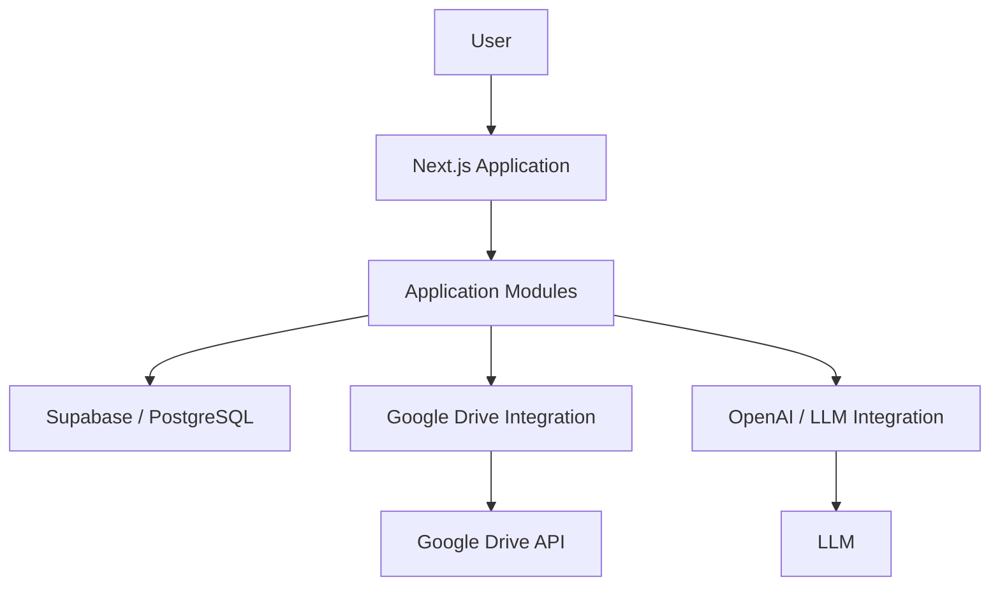
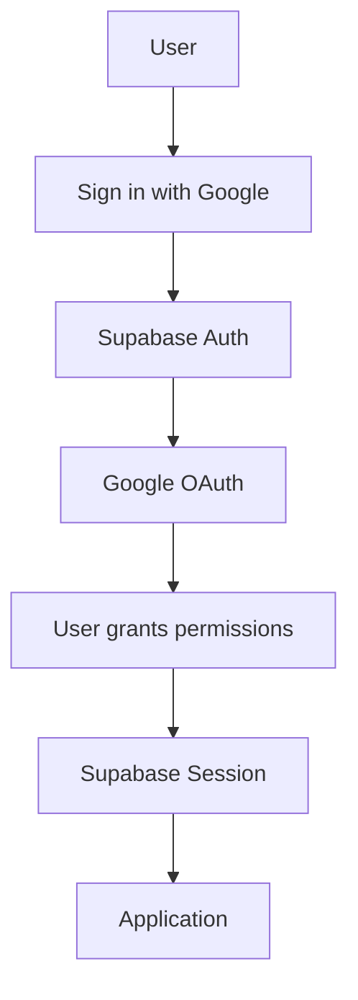
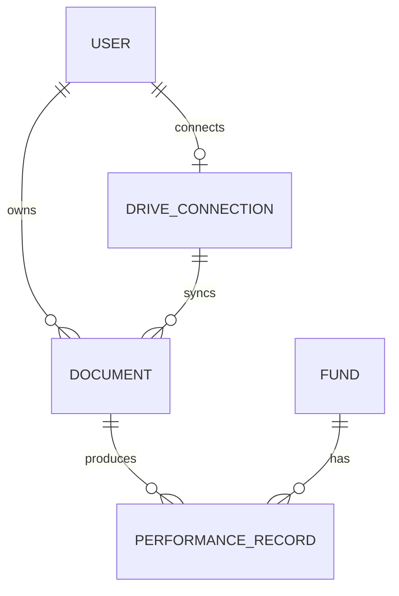
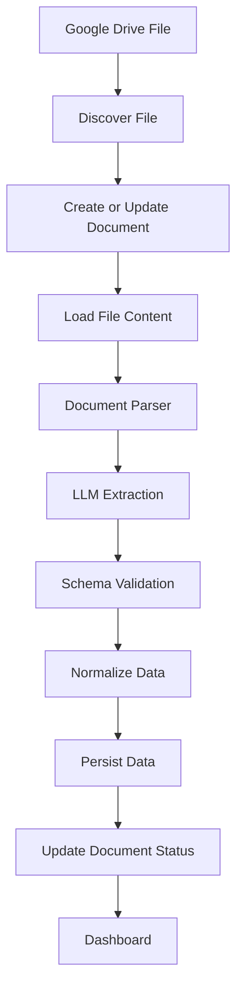
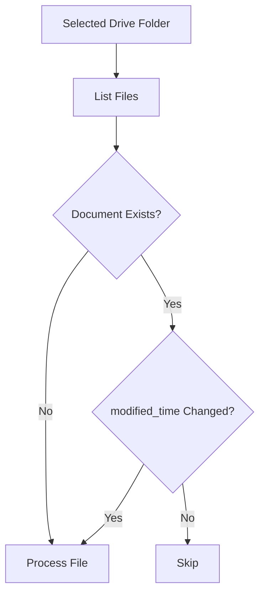
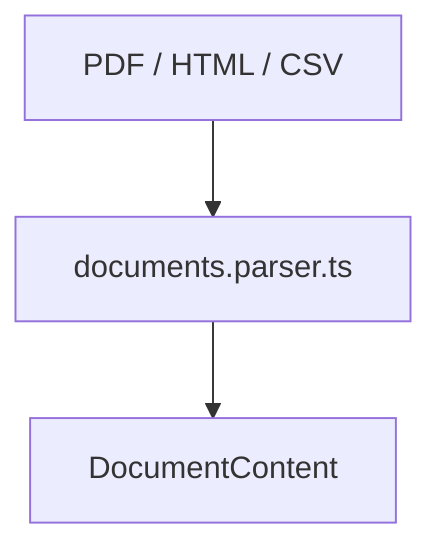
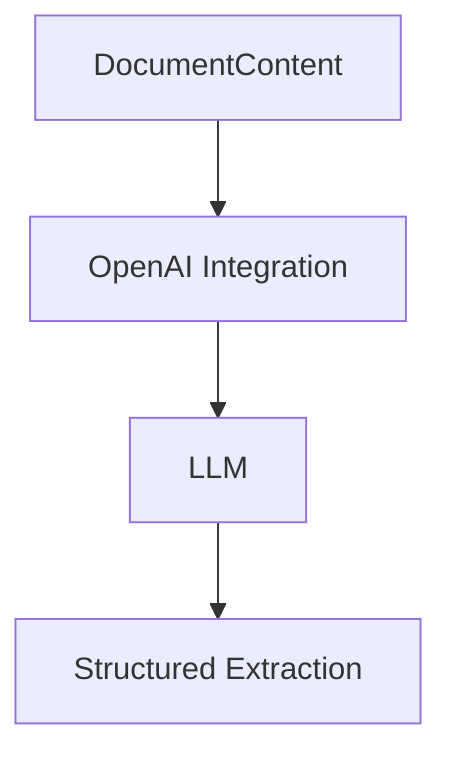
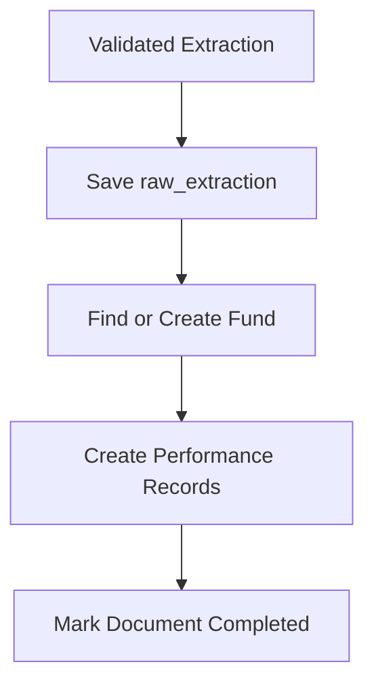
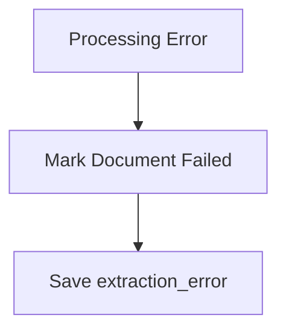
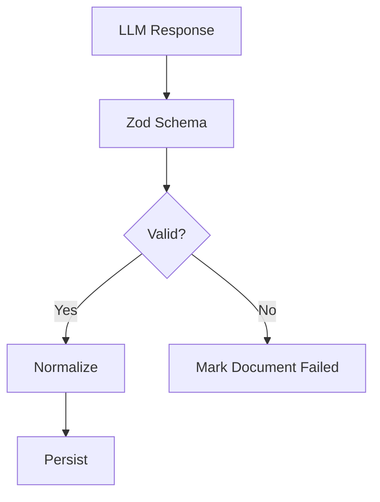

# Technical Architecture — Equi Document Intelligence

## 1. Goal

Build a simple, modular document intelligence application that:

* Connects to Google Drive through OAuth.
* Monitors one selected folder.
* Ingests PDF, HTML, and CSV files.
* Uses an LLM to understand document structure and extract normalized financial data.
* Stores document metadata and extracted records in Supabase/PostgreSQL.
* Exposes the data through a Next.js dashboard with search, filters, and sorting.

The system should remain focused on the assessment requirements and avoid unnecessary infrastructure.

---

## 2. Architecture

### 2.1 System Architecture



### 2.2 Components

#### Next.js

Main application layer.

Responsible for:

* UI
* Routes
* Authentication flow
* Server actions / API routes
* Calling application modules

Pages and components should not contain business logic that belongs inside modules.

---

#### Supabase

Used for:

* PostgreSQL database
* Authentication if needed
* Server-side database access

Google Drive remains the source of truth for original documents.

---

#### Google Drive

External document source.

Responsible for:

* OAuth authorization
* Folder selection
* Listing files
* Reading file metadata
* Downloading file content
* Detecting new or updated files

Google-specific implementation lives inside:

```text
src/integrations/google-drive/
```

---

#### OpenAI / LLM

Responsible for document understanding.

The LLM receives document content and must:

* Identify the document structure
* Understand terminology
* Understand tables and labels
* Identify financial entities and values
* Return structured output matching the extraction schema

LLM-specific implementation lives inside:

```text
src/integrations/openai/
```

---

## 3. Authentication & Google OAuth

Authentication is handled with **Supabase Auth**.

Google is used as the authentication provider and as the authorization mechanism for accessing the user's Google Drive.

### Authentication Flow



### Supabase

Use the Supabase CLI for local development and database/auth configuration.

Typical workflow:

```bash
supabase start
supabase status
supabase db reset
```

Supabase is responsible for:

* User authentication
* Session management
* User identity
* PostgreSQL persistence

Authentication-specific application code should use the existing Supabase clients under:

```text
src/lib/supabase/
├── client.ts
└── server.ts
```

### Google OAuth

Google OAuth must be configured in Google Cloud Console.

Required setup:

* Enable Google Drive API
* Configure OAuth consent screen
* Create OAuth Web Client
* Configure local and production redirect URLs
* Add the application as a test user while the OAuth app is in testing mode

Initial Google scopes:

```text
openid
email
profile
https://www.googleapis.com/auth/drive.readonly
```

`drive.readonly` is required so the application can read existing files from the folder selected by the user.

### Google Credentials

Required environment variables:

```text
GOOGLE_CLIENT_ID=
GOOGLE_CLIENT_SECRET=
```

Supabase Google provider configuration must use the same Google OAuth credentials.

### Drive Authorization

After authentication, the application must have enough Google authorization to access Drive.

The application should be able to:

```text
authenticate user
      ↓
obtain Google OAuth authorization
      ↓
access Google Drive API
      ↓
select folder
      ↓
read folder contents
```

The Google integration remains isolated under:

```text
src/integrations/google-drive/
```

Do not place Google OAuth or Drive-specific logic directly inside UI components.


## 4. Data Model

### 4.1 Entity Relationships



### 4.2 Entities

### User

Represents the application user.

Key data:

* `id`
* `email`
* profile information
* `created_at`
* `updated_at`

Relationships:

* Has one active Drive connection in the initial version
* Owns documents

---

### DriveConnection

Represents the user's Google Drive integration.

Key data:

* `id`
* `user_id`
* Google account identifier
* selected `folder_id`
* selected `folder_name`
* OAuth token information
* `created_at`
* `updated_at`

Relationships:

* Belongs to a user
* Provides documents from the selected folder

---

### Document

Represents one file discovered in the selected Google Drive folder.

Key data:

* `id`
* `user_id`
* `drive_connection_id`
* `drive_file_id`
* `name`
* `mime_type`
* `modified_time`
* `status`
* `raw_extraction`
* `extraction_error`
* `processed_at`
* `created_at`
* `updated_at`

Processing status:

```text
pending
processing
completed
failed
```

Relationships:

* Belongs to a user
* Comes from a Drive connection
* Produces performance records

`drive_file_id` uniquely identifies the source file from Google Drive.

---

### Fund

Represents a normalized fund identified from one or more documents.

Key data:

* `id`
* `name`
* `manager`
* `currency`
* `created_at`
* `updated_at`

Relationships:

* Can appear in many performance records

---

### PerformanceRecord

Represents normalized financial information extracted from a document.

Key data:

* `id`
* `document_id`
* `fund_id`
* `reporting_date`
* `monthly_return`
* `ytd_return`
* `nav`
* `benchmark`
* `currency`
* `created_at`

Relationships:

* Belongs to a document
* Belongs to a fund

Every normalized record must keep a reference to its source document.

---

## 5. Document Processing

### 5.1 Processing Flow



---

### 5.2 Drive Sync

The Drive integration scans the selected folder and determines whether each file should be processed.



Rules:

* New file → process
* Existing file with changed `modified_time` → process again
* Existing unchanged file → skip

---

### 5.3 Document Parser

`documents.parser.ts` prepares the source document for the LLM.

It does not interpret financial meaning.



Common internal representation:

```ts
type DocumentContent = {
  filename: string
  mimeType: string
  content: string | Buffer
}
```

The parser handles file preparation only.

Do not create manager-specific or document-specific parsers such as:

```text
BlackRockParser
VanguardParser
FundFactsheetParser
AccountStatementParser
```

The LLM is responsible for understanding those differences.

---

### 5.4 LLM Extraction

The document content is sent to the LLM together with the expected structured schema.



The LLM may identify:

* Document type
* Fund name
* Fund manager
* Reporting period
* Monthly return
* YTD return
* NAV
* Currency
* Benchmark

Example:

```ts
{
  documentType: "fund_factsheet",
  fund: {
    name: "Alpha Growth Fund",
    manager: "Alpha Capital",
    currency: "USD"
  },
  performance: [
    {
      reportingDate: "2026-01-31",
      monthlyReturn: 0.042,
      ytdReturn: 0.042,
      nav: 125.30
    }
  ]
}
```

The LLM handles differences in:

* Layout
* Terminology
* Tables
* Document structure
* Source format

---

### 5.5 Persistence

After validation, the extraction is normalized and persisted.



If processing fails:



---

## 6. Validation

All LLM output must be validated before being written into normalized database tables.

Use Zod.



Validation should cover:

* Required fields
* Dates
* Numeric values
* Percentages
* Currency
* Optional fields
* Extraction structure

Schemas live inside the related module.

Example:

```text
documents.schema.ts
funds.schema.ts
performance.schema.ts
```

---

## 7. Project Structure

The application follows a modular structure.

```text
src/
├── app/
│   └── ...                     # Next.js UI / routes
│
├── components/
│   └── ...                     # Shared UI components
│
├── modules/
│   ├── documents/
│   │   ├── documents.service.ts
│   │   ├── documents.repository.ts
│   │   ├── documents.parser.ts
│   │   ├── documents.types.ts
│   │   └── documents.schema.ts
│   │
│   ├── funds/
│   │   ├── funds.service.ts
│   │   ├── funds.repository.ts
│   │   ├── funds.types.ts
│   │   └── funds.schema.ts
│   │
│   ├── performance/
│   │   ├── performance.service.ts
│   │   ├── performance.repository.ts
│   │   ├── performance.types.ts
│   │   └── performance.schema.ts
│   │
│   ├── drive/
│   │   ├── drive.service.ts
│   │   ├── drive.repository.ts
│   │   └── drive.types.ts
│   │
│   └── search/
│       └── search.service.ts
│
├── integrations/
│   ├── google-drive/
│   │   ├── google-drive.client.ts
│   │   ├── google-drive.auth.ts
│   │   └── google-drive.types.ts
│   │
│   └── openai/
│       ├── openai.client.ts
│       └── openai.extractor.ts
│
└── lib/
    └── supabase/
        ├── client.ts
        └── server.ts
```

### Module Responsibilities

#### `service`

Contains application logic.

Examples:

```text
process document
sync Drive folder
normalize extraction
```

---

#### `repository`

Contains database access.

Examples:

```text
find document
create document
find fund
create performance record
```

Repositories should not contain business logic.

---

#### `parser`

Transforms source file content into the common document representation used by the LLM.

---

#### `schema`

Contains Zod validation schemas.

---

#### `types`

Contains shared TypeScript types for the module.

---
## 7. Testing

Use **Vitest** for unit testing.

The initial testing scope focuses on business logic inside:

```text
src/modules/
```

### What to Test

Unit tests should cover:

* Services
* Parsers
* Normalization logic
* Validation schemas
* Error handling
* Reprocessing / deduplication behavior where applicable

### Mocking

External dependencies must be mocked.

Examples:

* Google Drive API
* OpenAI / LLM calls
* Supabase repositories
* Network requests

Unit tests should not call real external services.

Example:

```text
documents.service.ts
        │
        ├── documents.repository.ts   → mock
        ├── google-drive integration  → mock
        └── openai integration        → mock
```

Tests should validate module behavior independently from infrastructure.

### Test Location

Keep tests close to the code they cover.

```text
src/modules/documents/
├── documents.service.ts
├── documents.service.test.ts
├── documents.parser.ts
├── documents.parser.test.ts
└── ...
```

### Test Runner

Use:

```bash
bun run test
```

Vitest is the default test runner for module-level unit tests.

Integration and end-to-end testing are outside the initial scope unless a specific feature requires them.


## 8. Non-Goals

The initial version does not include:

* AI agents
* Chat interface
* RAG
* Vector database
* Manager-specific parsers
* Microservices
* Complex queue infrastructure
* Multiple storage providers
* Advanced portfolio analytics
* Enterprise permissions
* Separate Python services unless a concrete document-processing requirement needs them
